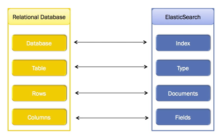

# Elastic Search course

## Main concepts
**Nodo**: stores the data that we add to Elastic Seach

**Cluster**: collection of nodes 

**Document**: Data is stored as documents

**Field**: One of the values of a document

**Index**: Documents are grouped together with indices

### Sharding
Sharding is a way to divide indices into smaller pieces. Each piece is a shard.
Sharding is done at index level.
The goal of sharding is horizontally scale the information

A shard acts an independent index

Goals of sharding:
- Be able to store more documents
- Easily fit large indices onto nodes
- Improved performance: parallelization of queries